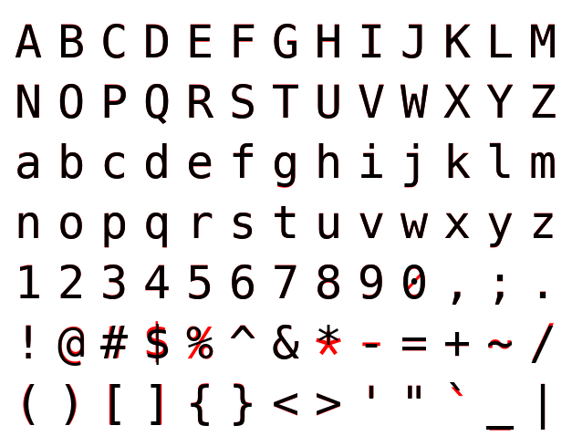

# 🎩 Baccano Font

Baccano is a monospace font based on DejaVu Sans Mono.

## ✨ Overview

Baccano inherits most glyphs from DejaVu Sans Mono, but several glyphs are
replaced or slightly adjusted for better display.

> Black is DejaVu Sans Mono, while red is Baccano.

You can view the
[commit history](https://github.com/loichyan/baccano-font/commits) for a
detailed list of changes.

## ⚖️ License

Licensed under SIL Open Font License (OFL), Version 1.1 ([LICENSE](LICENSE) or
<http://scripts.sil.org/OFL>).
